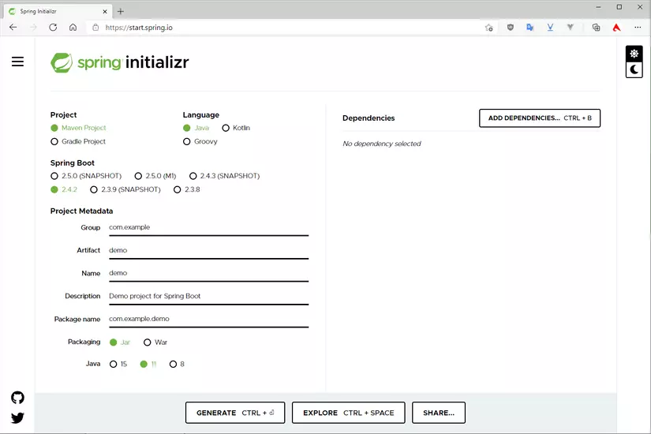

# Buổi 2: Spring MVC

## A. Khởi tạo dự án Spring Boot
Spring Boot có một công cụ giúp chúng ta nhanh chóng khởi tạo project gọi là Spring Initializr. Spring Initializr có thể truy cập trên web tại http://start.spring.io/, hoặc với IntelliJ thì có tích hợp luôn vào khi tạo project.




## B. Bean trong SpringBoot

### 1. Bean và ApplicationContext

### 1.1. Bean là gì?

Trong **documentation của Spring framework**, thì **bean** được định nghĩa như sau:

> In Spring, the objects that form the backbone of your application and that are managed by the Spring IoC container are called beans. A bean is an object that is instantiated, assembled, and otherwise managed by a Spring IoC container.

Nói một cách đơn giản, **bean** là những module chính của chương trình, được tạo ra và quản lý bởi **Spring IoC container**.

Các bean có thể **phụ thuộc lẫn nhau**, như ví dụ về `Car`, `Engine` và `ChinaEngine` từ đầu series tới giờ.  
Sự phụ thuộc này được mô tả cho IoC biết nhờ cơ chế **Dependency Injection**.

Cách đánh dấu class là một bean thì mình sẽ trình bày trong bài tiếp theo.  
Lúc này các bạn chỉ cần biết đơn giản nhất là dùng `@Component` lên class là class đó là một bean.

### 1.2. ApplicationContext (mở rộng của BeanFactory) là gì?

**ApplicationContext** là khái niệm Spring Boot dùng để chỉ **Spring IoC container**, tương tự như bean là đại diện cho các dependency.

Ngoài ra bạn có thể sẽ nghe nói về **BeanFactory**. Nó cũng đại loại như ApplicationContext, đại diện cho Spring IoC container nhưng ở mức cơ bản.  
**ApplicationContext** thì ở mức cao hơn, cung cấp nhiều tính năng hơn BeanFactory như *i18n*, *resolving messages*, *publishing events*,...


Khi ứng dụng Spring chạy, **Spring IoC container** sẽ quét toàn bộ packages, tìm ra các bean và đưa vào **ApplicationContext**.  
Cơ chế đó là **Component Scan**


### 1.3. Cách lấy bean ra từ Context

Tất nhiên trước khi lấy bean ra từ context thì phải có context rồi 
Câu hỏi đặt ra là biến context ở đâu?  
Đó là ngay dòng bắt đầu chương trình Spring Boot.

```java
@SpringBootApplication
public class Application {
    public static void main(String[] args) {
        SpringApplication.run(Application.class, args);
    }
}
```

Dòng method `SpringApplication.run()` sẽ return về một object **ApplicationContext** interface, đại diện cho IoC container.

```java
ApplicationContext context = SpringApplication.run(Application.class, args);
```

Chúng ta có thể lấy ra bean từ đây, dùng method `getBean()`.

```java
// Lấy ra bean có class cụ thể
Car car = context.getBean(Car.class);

// Lấy ra theo tên và class
// Tuy là Engine.class nhưng Engine lại là interface
Engine engine = context.getBean("ChinaEngine", Engine.class);
```

## 2. Kĩ thuật inject bean vào bean khác

Ví dụ bạn có hai bean là `Car` và `Engine` (như ví dụ từ đầu series tới giờ).
`Car` thì phụ thuộc vào `Engine`, do đó theo **Dependency Injection** thì chúng ta cần inject `Engine` vào trong `Car`.


### 2.1. Sử dụng `@Autowired`

Chúng ta sử dụng annotation `@Autowired` để báo cho Spring biết tự động tìm và inject bean phù hợp vào vị trí đặt annotation.

#### Engine.java

```java
// Annotation chỉ đánh dấu lên class
public interface Engine {
    void run();
}
```

#### ChinaEngine.java

```java
@Component
public class ChinaEngine implements Engine {
    @Override
    public void run() {}
}
```

#### Car.java

```java
@Component
public class Car {
    // Báo cho Spring tìm bean nào phù hợp với Engine interface
    // Và có một bean phù hợp là ChinaEngine
    // Nó tương đương với = new ChinaEngine()
    @Autowired
    private final Engine engine;
}
```

Cách dùng `@Autowired` trên **field** là **không được khuyến khích**,
do nó sử dụng **Java reflection** để inject.
Nên cân nhắc đổi qua **constructor-based** hoặc **setter-based injection**.

### 2.2. Inject qua constructor hoặc setter

Code inject theo kiểu **constructor-based** nên dùng khi các module là bắt buộc.
Spring Boot khi tạo bean (cũng chỉ là tạo object, gọi constructor thôi) thì sẽ đưa các phụ thuộc vào constructor khi gọi.

#### Constructor-based injection

```java
@Component
public class Car {
    private final Engine engine;

    // Các bản Spring Boot mới thì không cần @Autowired trên constructor
    public Car(Engine engine) {
        this.engine = engine;
    }
}
```

#### Setter-based injection

```java
@Component
public class Car {
    private final Engine engine;

    // Thêm @Required để setter luôn được gọi để inject
    @Required
    public void setEngine(Engine engine) {
        this.engine = engine;
    }
}
```

Cách dùng **setter injection** thường dùng trong **trường hợp phụ thuộc vòng**
(ví dụ module A phụ thuộc vào B và ngược lại).
Nếu cả hai đều dùng constructor injection, Spring Boot sẽ không biết nên tạo bean nào trước.
Giải pháp là một bean dùng constructor, một bean dùng setter như trên.

## 3. Khi Spring Boot không biết chọn bean nào?

### 3.1. Khi tìm thấy nhiều bean phù hợp

Ví dụ, nếu ta tạo thêm class `VNEngine` có chức năng tương tự `ChinaEngine`:

```java
@Component
public class VNEngine implements Engine {
    @Override
    public void run() {}
}
```

Spring Boot sẽ báo lỗi:

vì Spring tìm thấy **hai bean cùng implements Engine** (`VNEngine` và `ChinaEngine`),
nên không biết chọn cái nào để inject vào `Car`.

### 3.2. Giải pháp

Có hai cách giải quyết vấn đề này:

#### Cách 1: Dùng `@Primary`

Đánh dấu lên một bean để Spring ưu tiên chọn bean đó.

```java
@Component
@Primary
public class VNEngine implements Engine {
    ...
}
```

#### Cách 2: Dùng `@Qualifier`

Chỉ định rõ tên bean cụ thể được inject.

```java
@Component
public class Car {
    @Autowired
    @Qualifier("VNEngine")  // Phải khớp hoa thường luôn nhé
    private final Engine engine;
}
```

Với **constructor-based** hay **setter-based** cũng tương tự,
chỉ cần thêm `@Qualifier` trước tên field cần inject là được.

## C. Controller và Thymeleaf


### 1. Cài đặt

Trong bài này, sử dụng thêm thư viện `spring-boot-starter-thymeleaf`. Đây là một **Template Engine** hỗ trợ tạo HTML trả về cho người dùng.

**pom.xml**
```xml
<?xml version="1.0" encoding="UTF-8"?>
<project xmlns="http://maven.apache.org/POM/4.0.0" xmlns:xsi="http://www.w3.org/2001/XMLSchema-instance"
         xsi:schemaLocation="http://maven.apache.org/POM/4.0.0 http://maven.apache.org/xsd/maven-4.0.0.xsd">
  <modelVersion>4.0.0</modelVersion>
  <packaging>pom</packaging>

  <parent>
    <groupId>org.springframework.boot</groupId>
    <artifactId>spring-boot-starter-parent</artifactId>
    <version>2.0.5.RELEASE</version>
    <relativePath/> <!-- lookup parent from repository -->
  </parent>

  <groupId>me.loda.spring</groupId>
  <artifactId>spring-boot-learning</artifactId>
  <version>0.0.1-SNAPSHOT</version>
  <name>spring-boot-learning</name>
  <description>Everything about Spring Boot</description>

  <properties>
    <java.version>1.8</java.version>
  </properties>

  <dependencies>
    <!-- spring mvc, rest -->
    <dependency>
      <groupId>org.springframework.boot</groupId>
      <artifactId>spring-boot-starter-web</artifactId>
    </dependency>

    <!-- thymeleaf -->
    <dependency>
      <groupId>org.springframework.boot</groupId>
      <artifactId>spring-boot-starter-thymeleaf</artifactId>
    </dependency>
  </dependencies>

  <build>
    <plugins>
      <plugin>
        <groupId>org.springframework.boot</groupId>
        <artifactId>spring-boot-maven-plugin</artifactId>
      </plugin>
    </plugins>
  </build>
</project>
```

**Cấu trúc thư mục (minh họa)**


###  2. `@Controller`

Trong kiến trúc **Spring Boot**, `@Controller` là nơi tiếp nhận thông tin request từ phía người dùng. Nó nhận yêu cầu (kèm dữ liệu request) và chuyển xuống tầng `@Service` xử lý logic.

Quy trình tổng quát:


### HTML

Để tạo trang Web, tạo các file HTML trong thư mục mặc định: `resources/templates`.

Ví dụ: tên view `"index"` sẽ ánh xạ tới file `index.html`.

## Hello World

Tạo server web đơn giản để thấy `@Controller` hoạt động.

**WebController.java**

```java
import org.springframework.stereotype.Controller;
import org.springframework.web.bind.annotation.GetMapping;

// Đánh dấu đây là một Controller
// Nơi tiếp nhận các request từ phía người dùng
@Controller
public class WebController {

    // Đón nhận request GET tới "/"
    @GetMapping("/")
    public String index() {
        return "index"; // Trả về file index.html
    }
}
```

**index.html**

```html
<!DOCTYPE html>
<html>
<head>
  <title>Hello World</title>
</head>
<body>
  <h1>Đây là một trang web</h1>
</body>
</html>
```

**App.java**

```java
import org.springframework.boot.SpringApplication;
import org.springframework.boot.autoconfigure.SpringBootApplication;

@SpringBootApplication
public class App {
  public static void main(String[] args) {
    SpringApplication.run(App.class, args);
  }
}
```

Server chạy trên **port 8080**: mở `http://localhost:8080/`.

Ảnh minh họa:


## Ví dụ 2 — Hello Your Name!

**Cấu trúc thư mục (minh họa)**


**WebController.java (mở rộng)**

```java
import org.springframework.stereotype.Controller;
import org.springframework.ui.Model;
import org.springframework.web.bind.annotation.GetMapping;
import org.springframework.web.bind.annotation.RequestParam;

// Đánh dấu đây là một Controller
// Nơi tiếp nhận các request từ phía người dùng
@Controller
public class WebController {

    @GetMapping("/")
    public String index() {
        return "index"; // Trả về file index.html
    }

    @GetMapping("/about")
    public String about() {
        return "about"; // Trả về file about.html
    }

    @GetMapping("/hello")
    public String hello(
        // Request param "name" sẽ được gán vào biến
        @RequestParam(name = "name", required = false, defaultValue = "") String name,
        // Model là object Spring đính kèm vào mỗi request
        Model model
    ) {
        // Gắn name vào model
        model.addAttribute("name", name);

        return "hello"; // Trả về hello.html cùng dữ liệu trong Model
    }
}
```

**hello.html**

```html
<!DOCTYPE html>
<html lang="en" xmlns:th="http://www.thymeleaf.org">
<head>
  <title>Hello World</title>
</head>
<body>
  <h1 th:text="'Hello, ' + ${name}"></h1>
  <a href="/">Trang chủ</a>
</body>
</html>
```

**App.java**

```java
import org.springframework.boot.SpringApplication;
import org.springframework.boot.autoconfigure.SpringBootApplication;

@SpringBootApplication
public class App {
  public static void main(String[] args) {
    SpringApplication.run(App.class, args);
  }
}
```
## D. Rút gọn code Java với Lombok

Java là một ngôn ngữ tuyệt vời nhưng đôi khi nó quá chi tiết cho những đoạn code phổ biến. Bạn có cảm thấy lười biếng khi chúng ta thường khai báo các method `getter`, `setter`, `equals`, `hashCode`, `toString`... và việc này chiếm số lượng không nhỏ số dòng code? Việc lặp đi lặp lại hành động này có khiến bạn nhàm chán?

Để giải quyết điều này, bạn có thể sử dụng **Lombok** — một thư viện Java tự động sinh mã bytecode vào trong file `.class` của bạn dựa trên các chú thích (annotation) có sẵn. Lombok có nhiều annotation khác nhau và được xử lý trong quá trình **compile**, giúp code của bạn trông gọn gàng và “clear” hơn rất nhiều.


### Cài đặt Lombok

Bạn có thể tải Lombok trực tiếp trên trang chủ [https://projectlombok.org/](https://projectlombok.org/) hoặc cài đặt plugin trong IDE.

#### Với **Maven**:

```xml
<dependency>
    <groupId>org.projectlombok</groupId>
    <artifactId>lombok</artifactId>
    <version>1.16.20</version>
</dependency>
```

#### Cài đặt Lombok trong IntelliJ IDEA:

Vào `File > Settings > Plugins > Search Lombok Plugin > Install`.


Sau khi cài, bạn cần **bật Annotation Processing** để IDE hiểu được các annotation của Lombok:


### Ví dụ minh họa

#### Trước khi dùng Lombok

```java
@Entity
@Table(name = "user")
public class User {

  private static final long serialVersionUID = 7913573335665714061L;

  @Id
  @GeneratedValue(strategy = GenerationType.IDENTITY)
  @Column(name = "id")
  private Long id;

  @Column(name = "first_name")
  private String firstName;

  @Column(name = "last_name")
  private String lastName;

  @Column(name = "phone_number")
  private String phoneNumber;

  @Temporal(TemporalType.DATE)
  @Column(name = "birthday")
  private Date birthday;

  @Column(name = "password")
  private String password;

  public User() {}

  public User(String firstName, String lastName, String phoneNumber, Date birthday, String password) {
    this.firstName = firstName;
    this.lastName = lastName;
    this.phoneNumber = phoneNumber;
    this.birthday = birthday;
    this.password = password;
  }

  public Long getId() { return id; }
  public void setId(Long id) { this.id = id; }

  public String getFirstName() { return firstName; }
  public void setFirstName(String firstName) { this.firstName = firstName; }

  public String getLastName() { return lastName; }
  public void setLastName(String lastName) { this.lastName = lastName; }

  public String getPhoneNumber() { return phoneNumber; }
  public void setPhoneNumber(String phoneNumber) { this.phoneNumber = phoneNumber; }

  public Date getBirthday() { return birthday; }
  public void setBirthday(Date birthday) { this.birthday = birthday; }

  public String getPassword() { return password; }
  public void setPassword(String password) { this.password = password; }

  @Override
  public String toString() {
    return "User{" +
        "id=" + id +
        ", firstName='" + firstName + '\'' +
        ", lastName='" + lastName + '\'' +
        ", phoneNumber='" + phoneNumber + '\'' +
        ", birthday=" + birthday +
        ", password='" + password + '\'' +
        '}';
  }
}
```

---

#### Sau khi dùng Lombok


---

### Giải thích các Annotation

* **@Getter**, **@Setter**: Tự động sinh các method `getter()` và `setter()`.
* **@NoArgsConstructor**: Tạo constructor mặc định không có tham số.
* **@AllArgsConstructor**: Tạo constructor với tất cả thuộc tính được truyền vào.
* **@ToString**: Tự động sinh method `toString()`.
* **@Builder**: Tạo builder pattern cho class.
* **@Data**: Kết hợp các annotation:

  * `@ToString`
  * `@EqualsAndHashCode`
  * `@Getter`
  * `@Setter`
    Đồng thời, tạo constructor cho các field `@NonNull` hoặc `final`. Đây là annotation “tổng hợp” cho POJO.

Ví dụ:

```java
@Data
public class User {
    private String userName;
    private String phoneNumber;
    private String address;
}
```
