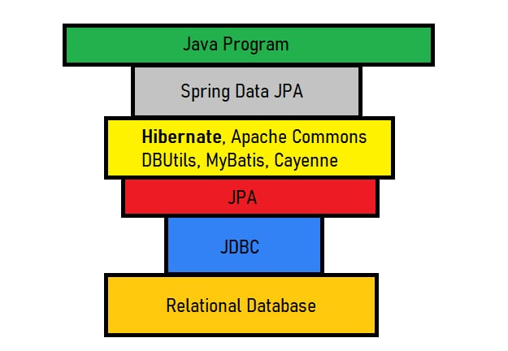
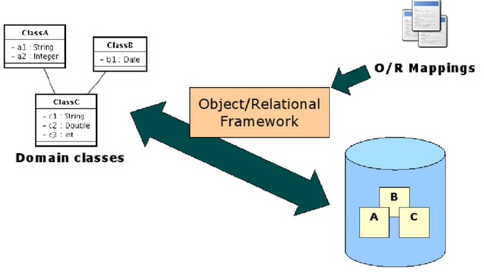
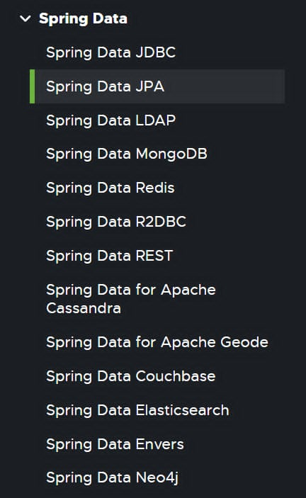

# Buổi 8: Tương tác với database
Người thực hiện: Nguyễn Hữu Tiến

- [Buổi 8: Tương tác với database](#buổi-8-tương-tác-với-database)
  - [1. Spring data JPA là gì? Spring data là gì?](#1-spring-data-jpa-là-gì-spring-data-là-gì)
    - [1.1. Giới thiệu về Spring data JPA và Spring data](#11-giới-thiệu-về-spring-data-jpa-và-spring-data)
      - [1.1.1. Spring data JPA](#111-spring-data-jpa)
      - [1.1.2. Spring data JPA hoạt động như thế nào? (Không giảng trên lớp, chỉ cho ai muốn hiểu sâu hơn)](#112-spring-data-jpa-hoạt-động-như-thế-nào-không-giảng-trên-lớp-chỉ-cho-ai-muốn-hiểu-sâu-hơn)
        - [1.1.2.1. ORM (object - relational mapping) là gì?](#1121-orm-object---relational-mapping-là-gì)
        - [1.1.2.2. JPA là gì? Khác gì với Spring data JPA?](#1122-jpa-là-gì-khác-gì-với-spring-data-jpa)
        - [1.1.2.3. JPA provider là gì? Mối quan hệ với JDBC?](#1123-jpa-provider-là-gì-mối-quan-hệ-với-jdbc)
        - [1.1.2.4. Vậy Spring data JPA đóng vai trò gì?](#1124-vậy-spring-data-jpa-đóng-vai-trò-gì)
      - [1.1.3. Spring data](#113-spring-data)
  - [2. Các annotations cơ bản](#2-các-annotations-cơ-bản)
    - [2.1. Nhóm ánh xạ, thực thể](#21-nhóm-ánh-xạ-thực-thể)
  - [| `@Transient` | Trường không được ánh xạ vào DB (sẽ bị JPA bỏ qua). |](#-transient--trường-không-được-ánh-xạ-vào-db-sẽ-bị-jpa-bỏ-qua-)
    - [2.2. Nhóm quan hệ giữa các bảng](#22-nhóm-quan-hệ-giữa-các-bảng)
    - [2.3. Nhóm ánh xạ truy vấn tùy chỉnh](#23-nhóm-ánh-xạ-truy-vấn-tùy-chỉnh)
    - [2.4. Nhóm Repository/CRUD](#24-nhóm-repositorycrud)
    - [2.5. Nhóm dùng cho Auditing (theo dõi lịch sử tạo/sửa)](#25-nhóm-dùng-cho-auditing-theo-dõi-lịch-sử-tạosửa)
  - [3. Các cách tiếp cận Spring data JPA từ high -\> low abstraction level](#3-các-cách-tiếp-cận-spring-data-jpa-từ-high---low-abstraction-level)
    - [3.1. Abstraction level là gì?](#31-abstraction-level-là-gì)
    - [3.2. Derived query method (truy vấn theo tên hàm)](#32-derived-query-method-truy-vấn-theo-tên-hàm)
    - [3.3. JPQL với @Query (trừu tượng trung bình)](#33-jpql-với-query-trừu-tượng-trung-bình)
    - [3.4. Native query (SQL thuần)](#34-native-query-sql-thuần)
    - [3.4. Entity manager](#34-entity-manager)
    - [3.5. Ưu và nhược điểm của high - low abstraction level, nên dùng ở mức trừu tượng nào?](#35-ưu-và-nhược-điểm-của-high---low-abstraction-level-nên-dùng-ở-mức-trừu-tượng-nào)
  - [4. Biểu diễn quan hệ trong Spring data JPA](#4-biểu-diễn-quan-hệ-trong-spring-data-jpa)
    - [4.1. @OneToOne - quan hệ 1-1](#41-onetoone---quan-hệ-1-1)
    - [4.2. @OneToMany/@ManyToOne - quan hệ 1-n, n-1](#42-onetomanymanytoone---quan-hệ-1-n-n-1)
    - [4.3. @ManyToMany - quan hệ n-n](#43-manytomany---quan-hệ-n-n)
    - [4.4. Lazy và Eager fetching](#44-lazy-và-eager-fetching)
      - [4.4.1. Eager fetching (tải ngay lập tức)](#441-eager-fetching-tải-ngay-lập-tức)
      - [4.4.2. Lazy fetching (tải khi cần)](#442-lazy-fetching-tải-khi-cần)
    - [4.6. Cascade type](#46-cascade-type)
  - [5. Bài tập](#5-bài-tập)

## 1. Spring data JPA là gì? Spring data là gì?
### 1.1. Giới thiệu về Spring data JPA và Spring data
#### 1.1.1. Spring data JPA
* Spring data JPA là một framework đóng vai trò trung gian trong ứng dụng Spring boot giúp tối thiểu hóa những thao tác phức tạp với database như kết nối, viết query thủ công dài dòng,...
* Việc sử dụng Spring data JPA giúp cho lập trình viên Spring boot tập trung vào nghiệp vụ hệ thống hơn là tốn thời gian xử lý những chi tiết nhỏ lặp đi lặp lại (boilerplate code).

#### 1.1.2. Spring data JPA hoạt động như thế nào? (Không giảng trên lớp, chỉ cho ai muốn hiểu sâu hơn)


Nhìn vào sơ đồ trên chúng ta có thể hiểu rằng Spring data JPA không hề làm việc đơn lẻ, mà còn các thành phần khác hỗ trợ:
* Tầng 1 là Spring data JPA, nơi chúng ta tương tác trự tiếp
* Tầng ngay dưới là Hibernate, tầng này được gọi là JPA provider
* Tầng 3 là JPA (Java/Jakarta persistence API)
* Tầng 4 là JDBC (Java database connectivity)

##### 1.1.2.1. ORM (object - relational mapping) là gì?


Trước khi tìm hiểu sâu hơn về Spring data JPA thì ta cần phải biết ORM là gì?

ORM là một kỹ thuật lập trình giúp ánh xạ các record trong DBMS sang object ở trong ngôn ngữ lập trình.

ORM không chỉ áp dụng trong Java mà gần như mọi ngôn ngữ lập trình.

Hibernate là một ORM trong Java, ngoài Hibernate chúng ta còn có EclipseLink, OpenJPA,...

Tham khảo thêm: https://viblo.asia/p/object-relational-mapping-djeZ1PQ3KWz

##### 1.1.2.2. JPA là gì? Khác gì với Spring data JPA?
JPA là một đặc tả (specification) định nghĩa ra một cấu trúc các API để kết nối với database. Hiểu đơn giản thì JPA là một cái interface chứa các phương thức, không có triển khai cụ thể, nó chỉ là cái khung cho các JPA provider triển khai.

##### 1.1.2.3. JPA provider là gì? Mối quan hệ với JDBC?
JPA provider là thành phần triển khai (implementation) của JPA.

JPA provider là những ORM đứng phía sau triển khai phần logic phức tạp như:
* Ánh xạ object <-> record
* Sinh truy vấn
* Quản lý entity life cycle
* Giao tiếp với database sử dụng JDBC
* Tối ưu truy vấn, caching
* Lazy/eager loading
* Quản lý transaction
* ...

JPA provider tiêu biểu nhất là Hibernate. Đây cũng chính là provider mặc định cho Spring data JPA. Bên cạnh đó ta còn có EclipseLink, OpenJPA,... Để có thể sử dụng những provider khác thì cần phải thêm dependency của provider tương ứng.

**Vậy mối quan hệ giữa JPA provider với tầng thấp nhất JDBC là gì?**  

JPA provider không thể tự mình kết nối và thực hiện những thao tác trực tiếp với database mà phải thông qua JDBC provider của từng loại database tương ứng.

##### 1.1.2.4. Vậy Spring data JPA đóng vai trò gì?
Tuy là ORM đã giảm bớt sự phức tạp khi kết nối với database rồi nhưng việc sử dụng ORM vẫn còn khá khó khăn.

Thực chất thì Spring data JPA là chỉ người đóng gói tất cả những đoạn code lặp đi lặp lại của hibernate. Hibernate mới là đối tượng thực sự xử lý và tương tác với database

Hiểu đơn giản thì Hibernate là người phụ bếp, phụ trách xử lý nguyên liệu, còn Spring data JPA là người đầu bếp sắp xếp, chế biến các món ăn theo order của khách.

> Chỗ này vẫn giải thích rất lủng củng và mơ hồ. Cần phải hiểu rõ hơn về cách Spring data JPA gen code.

#### 1.1.3. Spring data
* Spring data là cả một hệ sinh thái các framework dùng để tương tác với CSDL trong Spring.
* Spring data JPA là một framework trong rất nhiều framework nằm trong Spring data, dành riêng cho các thao tác với RDBMS.
* Ngoài Spring data JPA thì Spring data còn hỗ trợ rất nhiều framework tùy từng loại database khác nhau.


* Các framework thông dụng nhất trong Spring data:
  * Spring data JPA: để tương tác với RDBMS
  * Spring data MongoDB: để tương tác với CSDL NoSQL
  * Spring data Redis: để tương tác với CSDL Redis

https://spring.io/projects/spring-data

## 2. Các annotations cơ bản
### 2.1. Nhóm ánh xạ, thực thể
| Annotation | Mục đích |
|-----------|----------|
| `@Entity` | Đánh dấu lớp là một entity (thực thể) JPA (sẽ ánh xạ với một bảng trong DB). |
| `@Table(name = "ten_bang")` | Chỉ định tên bảng trong DB nếu khác với tên class. |
| `@Id` | Đánh dấu trường là khóa chính. |
| `@GeneratedValue(strategy = GenerationType.…)` | Chỉ định cách tạo giá trị cho khóa chính (AUTO, IDENTITY, SEQUENCE, TABLE). |
| `@Column(name = "ten_cot", nullable = false, length = 100)` | Tùy chỉnh ánh xạ cột, độ dài, null/not null,… |
| `@Transient` | Trường không được ánh xạ vào DB (sẽ bị JPA bỏ qua). |
---

### 2.2. Nhóm quan hệ giữa các bảng
| Annotation | Mục đích |
|-----------|----------|
| `@OneToOne` | Quan hệ một-một. |
| `@OneToMany` | Quan hệ một-nhiều. |
| `@ManyToOne` | Quan hệ nhiều-một. |
| `@ManyToMany` | Quan hệ nhiều-nhiều. |
| `@JoinColumn(name = "foreign_key")` | Chỉ định tên cột khóa ngoại. |
| `@JoinTable` | Dùng trong quan hệ `@ManyToMany` để xác định bảng trung gian. |

---
### 2.3. Nhóm ánh xạ truy vấn tùy chỉnh

| Annotation | Mục đích |
|-----------|----------|
| `@Query("JPQL query")` | Viết truy vấn JPQL tùy chỉnh. |
| `@Query(value = "SQL thuần", nativeQuery = true)` | Viết truy vấn SQL thuần. |
| `@Modifying` | Đánh dấu các truy vấn thay đổi dữ liệu (`UPDATE`, `DELETE`). |
| `@Transactional` | Đánh dấu phương thức cần transaction khi thực thi. |
| `@Param("ten")` | Ánh xạ tham số truy vấn tên định danh với giá trị truyền vào. |

---

### 2.4. Nhóm Repository/CRUD

| Annotation | Mục đích |
|-----------|----------|
| `@Repository` | Đánh dấu class là một Repository để Spring quét và xử lý exception. Thường không cần dùng nếu extends `JpaRepository`. |

---

### 2.5. Nhóm dùng cho Auditing (theo dõi lịch sử tạo/sửa)
<!-- Cái này cop chatgpt thôi chứ cũng chưa dùng bao giờ -->

| Annotation | Mục đích |
|-----------|----------|
| `@CreatedDate` | Tự động gán ngày tạo. |
| `@LastModifiedDate` | Tự động gán ngày cập nhật gần nhất. |
| `@CreatedBy` / `@LastModifiedBy` | Gán thông tin người tạo/cập nhật (cần cấu hình `AuditorAware`). |
| `@EnableJpaAuditing` | Bật tính năng Auditing (đặt trong `@Configuration`). |

## 3. Các cách tiếp cận Spring data JPA từ high -> low abstraction level
### 3.1. Abstraction level là gì?
* Đây không phải là keyword của Spring data. Abstraction level có nghĩa là mức độ trừu tượng, hiểu đơn giản thì mức độ trừu tượng càng cao thì framework lo cho mình càng nhiều và mình làm càng ít.
* Ví dụ như đoạn code sau là high abstraction level:
  ```java
    public interface UserRepository extends JpaRepository<User, Long> {
        Optional<User> findByUsername(String username);
        boolean existsByUsername(String username);
        List<User> findByRoleAndIsDeleted(Role role, Boolean isDeleted);
        List<User> findByTypeAndIsDeleted(Type type, Boolean isDeleted);
    }
  ```
  ---
* Đoạn code sau cũng xử lý logic tương tự nhưng mức độ trừu tượng thấp hơn:
  ```java
    public interface UserRepository extends JpaRepository<User, Long> {

      @Query("SELECT u FROM User u WHERE u.username = :username")
      Optional<User> findByUsername(@Param("username") String username);

      @Query("SELECT COUNT(u) > 0 FROM User u WHERE u.username = :username")
      boolean existsByUsername(@Param("username") String username);

      @Query("SELECT u FROM User u WHERE u.role = :role AND u.isDeleted = :isDeleted")
      List<User> findByRoleAndIsDeleted(@Param("role") Role role,
                                        @Param("isDeleted") Boolean isDeleted);

      @Query("SELECT u FROM User u WHERE u.type = :type AND u.isDeleted = :isDeleted")
      List<User> findByTypeAndIsDeleted(@Param("type") Type type,
                                        @Param("isDeleted") Boolean isDeleted);
  }
  ```
  ---

### 3.2. Derived query method (truy vấn theo tên hàm)
Đây là cách đơn giản nhất, chỉ cần đặt tên phương thức theo chuẩn. Spring sẽ tự động quét các phương thức và triển khai.

Cấu trúc tên hàm chuẩn của Spring data JPA  
> \<action>By\<field1>[And|Or]\<field2>...

Trong đó:
* action: hành động (find, get, delete, count,...)
* field1: các trường bất kỳ trong entity
* and/or: toán tử logic
* Ngoài ra còn có thể kết hợp thêm các toán tử so sánh như: Is, IsNot, Equals, Like, StartingWith,...
* Có thể thêm orderBy để sắp xếp kết quả

Ví dụ:  
```java
// Lấy người dùng theo email
Optional<User> findByEmail(String email);

// Kiểm tra tồn tại username (boolean)
boolean existsByUsername(String username);

// Đếm người dùng đang hoạt động
long countByActiveTrue();

// Tìm người dùng theo điều kiện
List<User> findByLastNameAndAgeGreaterThanOrderByCreatedAtDesc(String lastName, int age);

// Lấy top 5 người dùng có role ADMIN
List<User> findTop5ByRoleOrderByCreatedAtDesc(Role role);

// Tìm theo chuỗi không phân biệt hoa thường
List<User> findByEmailContainingIgnoreCase(String emailFragment);
```

### 3.3. JPQL với @Query (trừu tượng trung bình)
Viết câu lệnh truy vấn thủ công sử dụng JPQL.

JPQL là ngôn ngữ truy vấn dựa trên entity, sử dụng các field của entity để tính toán, so sánh thay vì  sử dụng field thật trong db.

Ví dụ:  
```java
@Query("SELECT u FROM User u WHERE u.role = :role AND u.isDeleted = false")
List<User> findActiveUsers(@Param("role") Role role);
```

### 3.4. Native query (SQL thuần)
Viết câu lệnh truy vấn thủ công sử dụng SQL thuần.

Ví dụ:
```java
@Query(value = "SELECT * FROM users WHERE role = :role AND is_deleted = 0", nativeQuery = true)
List<User> findActiveUsers(@Param("role") String role);
```

Việc sử dụng native query có thể giúp tối ưu sâu hơn, sử dụng những hàm đặc thù của mỗi DB, hay sử dụng những truy vấn phức tạp.

<!-- ### 3.4. Specification API (Predicate builder) – Truy vấn động, theo tiêu chí
Chưa biết:)) -->

### 3.4. Entity manager
Truy vấn được viết bằng JPQL/SQL thủ công, thao tác trực tiếp với EntityManager.

Tối đa quyền kiểm soát, nhưng mất sự đơn giản, cần xử lý thủ công.

Ví dụ:  
```java
@Repository
public class UserCustomRepository {

    @PersistenceContext
    private EntityManager entityManager;

    public List<User> findUsersByCustomCriteria(String keyword) {
        String jpql = "SELECT u FROM User u WHERE u.username LIKE :keyword";
        return entityManager.createQuery(jpql, User.class)
                            .setParameter("keyword", "%" + keyword + "%")
                            .getResultList();
    }
}
```

### 3.5. Ưu và nhược điểm của high - low abstraction level, nên dùng ở mức trừu tượng nào?
Câu trả lời là tùy thuộc vào độ phức tạp của yêu cầu, cần tối ưu kỹ thì mới cần đến những mức trừu tượng thấp.

Nếu không thì nên chọn mức trừu tượng cao để cho tiết kiệm thời gian, giảm độ phức tạp của code, giảm thời gian code và dễ sửa lỗi hơn.

## 4. Biểu diễn quan hệ trong Spring data JPA
### 4.1. @OneToOne - quan hệ 1-1
Một entity liên kết với một entity khác.

Ví dụ: Mỗi User có một Profile
```java
@Entity
public class User {
    @Id
    private Long id;

    @OneToOne(cascade = CascadeType.ALL)
    @JoinColumn(name = "profile_id", referencedColumnName = "id")
    private Profile profile;
}
```
---
```java
@Entity
public class Profile {
    @Id
    private Long id;

    @OneToOne(mappedBy = "profile")
    private User user;
}
```
---
### 4.2. @OneToMany/@ManyToOne - quan hệ 1-n, n-1
Một entity có thể liên kết với nhiều entity khác, và ngược lại.

Ví dụ: Một Category có nhiều Product
```java
@Entity
public class Category {
    @Id
    private Long id;

    @OneToMany(mappedBy = "category")
    private List<Product> products;
}
```
---
```java
@Entity
public class Product {
    @Id
    private Long id;

    @ManyToOne
    @JoinColumn(name = "category_id")
    private Category category;
}
```
---

### 4.3. @ManyToMany - quan hệ n-n
Một entity liên kết với nhiều entity khác và ngược lại.

Ví dụ: Một Student học nhiều Course, và một Course có nhiều Student
```java
@Entity
public class Student {
    @Id
    private Long id;

    @ManyToMany
    @JoinTable(
        name = "student_course",
        joinColumns = @JoinColumn(name = "student_id"),
        inverseJoinColumns = @JoinColumn(name = "course_id")
    )
    private List<Course> courses;
}
```
---

```java
@Entity
public class Course {
    @Id
    private Long id;

    @ManyToMany(mappedBy = "courses")
    private List<Student> students;
}
```
---

### 4.4. Lazy và Eager fetching
Lazy fetching và Eager fetching là hai chiến lược tải dữ liệu (fetching strategy) khi truy vấn các entity liên kết qua các quan hệ như @OneToMany, @ManyToOne, @OneToOne, @ManyToMany.

#### 4.4.1. Eager fetching (tải ngay lập tức)
* Các entity liên kết sẽ được tải ngay cùng lúc với entity chính, kể cả khi chưa cần dùng.

* Dễ gây truy vấn nặng (JOIN nhiều bảng) nếu không cẩn thận.

Ví dụ:
```java
@OneToOne(fetch = FetchType.EAGER)
private Profile profile;
```

Khi gọi userRepository.findById(1L) → User và Profile sẽ được truy vấn cùng lúc.

#### 4.4.2. Lazy fetching (tải khi cần)
* Các entity liên kết chưa được tải ngay, mà sẽ chỉ tải khi bạn truy cập đến nó.
* Giúp giảm tải dữ liệu ban đầu, nhưng có thể gây LazyInitializationException nếu không xử lý đúng.

Ví dụ:
```java
@OneToMany(mappedBy = "category", fetch = FetchType.LAZY)
private List<Product> products;
```

Khi gọi categoryRepository.findById(1L), chỉ Category được tải.  
Khi gọi category.getProducts(), lúc đó JPA mới tải thêm Product (nếu session còn mở).

### 4.6. Cascade type
Cascade Type là cơ chế cho phép tự động lan truyền các thao tác (persist, remove, merge, ...) từ entity cha xuống các entity con liên quan.

- *CascadeType.PERSIST*
    - Tự động lưu entity con khi lưu entity cha
    
    ```java
    @Entity
    public class Category {
        @OneToMany(cascade = CascadeType.PERSIST)
        private List<Product> products;
    }
    ```
    
    - Nếu `Category` được lưu, thì các `Product` trong danh sách cũng được lưu.
    - Nếu `Product` đã có sẵn trong DB, nhưng `Category` chưa được lưu, thì `Product` không bị ảnh hưởng.
- *CascadeType.MERGE*
    - Tự động cập nhật entity con khi cập nhật entity cha
    
    ```java
    @Entity
    public class Order {
        @OneToMany(cascade = CascadeType.MERGE)
        private List<OrderItem> orderItems;
    }
    ```
    
    - Nếu `Order` được cập nhật (`merge`), thì các `OrderItem` trong danh sách cũng được cập nhật.
    - Nếu `OrderItem` chưa tồn tại trong DB, thì nó không được lưu tự động.
- *CascadeType.REMOVE*
    - Tự động xóa entity con khi xóa entity cha
    
    ```java
    @Entity
    public class Company {
        @OneToMany(cascade = CascadeType.REMOVE)
        private List<Employee> employees;
    }
    ```
    
    - Nếu `Company` bị xóa, thì tất cả `Employee` thuộc về nó cũng bị xóa.
    - Nếu `Employee` không có `cascade = REMOVE`, bạn phải xóa từng `Employee` bằng tay.
- *CascadeType.REFRESH*
    - Làm mới entity con khi làm mới entity cha. Làm mới ở đây là tải lại entity từ DB nhằm đảm bảo sự chính xác giữa entity và DB.
    
    ```java
    @Entity
    public class Department {
        @OneToMany(cascade = CascadeType.REFRESH)
        private List<Employee> employees;
    }
    ```
    
    - Khi gọi `entityManager.refresh(department, tất cả `Employee` trong `department` cũng được làm mới từ DB.
    - Dùng khi bạn muốn đảm bảo dữ liệu trong bộ nhớ phản ánh chính xác dữ liệu trong DB.
- *CascadeType.DETACH*
    - Tách entity con khỏi EntityManager khi cha bị detach. Tách ở đây là EntityManager không quản lý entity đó nữa.
    
    ```java
    @Entity
    public class Project {
        @OneToMany(cascade = CascadeType.DETACH)
        private List<Task> tasks;
    }
    ```
    
    - Khi gọi `entityManager.detach(project);`, tất cả `Task` trong `Project` cũng bị detach khỏi EntityManager.
    - Entity đã bị detach sẽ *không được quản lý* bởi Hibernate nữa, và *mọi thay đổi sẽ không được cập nhật vào DB*.
- *CascadeType.ALL*
    - Truyền tải tất cả các hoạt động từ thực thể cha sang thực thể con

## 5. Bài tập
Triển khai Spring data JPA cho mini project cá nhân.